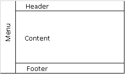

<h1>Entendendo o Desafio</h1>

Este desafio tem como objetivo, criar um site "quase" completo, com tudo o que vimos neste módulo. Os temas que deverão ser abordados são:

*   Formulários
*   Estruturação e formatação de texto
*   Mídias
*   Tabelas
Além de outros recursos falados nas aulas!

## Instruções 

<ol>
    <li>Você deve criar um site de uma clínica médica (você escolhe a especialidade)</li>
    <li>Este site deve conter o seguinte menu de navegação:
        <ul>
            <li>Página Principal</li>
            <li>Sobre a clínica</li>
            <li>Horário de Atendimento</li>
            <li>Contato</li>
        </ul>
    </li>
    <li>Deve, obrigatoriamente, utilizar todas os assuntos abordados nas aulas.</li>
</ol>

Abaixo como cada páginna deve ser criada e estruturada.

## Estrutura das Páginas
Todas as páginas terão que seguir um padrão prédefinido. Como não aprendemos sobre CSS ainda, utilize o arquivo [`template.html`](template/template.html) para utilizar como base. Ele segue uma estrutura semelhante a imagem abaixo.

_* No template ten algumas cores mas é apenas para melhor visualização. Fique a vontade para altarer da melhor forma._

no __Menu__, ficará localizado o menu de navegação (não me diga!), no __Header__ de cada página ficará uma imagem, no __Footer__ informações de contato, e o __Main__ é o conteúdo de cada página.

## Página Principal
<ol>
    <li>Deve ter uma imagem no <strong>Header</strong>.</li>
    <li>Em <strong>Content</strong> uma breve descrição sobre a clínica.</li>
    <li><strong>Menu</strong> e <strong>Footer</strong> padrões em todas as páginas.</li>
</ol>

## Sobre a clínica
<ol>
    <li>Deve ter uma imagem diferente do <strong>Header</strong>.</li>
    <li>Em <strong>Content</strong> uma texto falando sobre a clínica.</li>
    <li><strong>Menu</strong> e <strong>Footer</strong> padrões em todas as páginas.</li>
</ol>

## Horário de Atendimento
<ol>
    <li>Deve ter uma imagem diferente do <strong>Header</strong>.</li>
    <li>Em <strong>Content</strong> um pequeno texto falando sobre os serviços, e uma tabela de preços, onde cada linha é um serviço, com o preço de cada um de acordo com os dias da semana.
     
     
    <table>
    <theader>
        <th>Serviços</th>
        <th>Segunda a Sexta</th>
        <th>Sábados</th>
        <th>Feriados</th>
    </theader>
    <tbody>
        <tr>
            <td>Clínica geral</td>
            <td>08h - 19h</td>
            <td>08h - 14h</td>
            <td>08h - 14h</td>
        </tr>
        <tr>
            <td>Psicologia</td>
            <td>08h - 19h</td>
            <td>08h - 14h</td>
            <td>08h - 14h</td>
        </tr>
        <tr>
            <td>Pediatria</td>
            <td>08h - 19h</td>
            <td>08h - 14h</td>
            <td> - </td>
        </tr>
        <tr>
            <td>Oftalmologia</td>
            <td>08h - 19h</td>
            <td>08h - 14h</td>
            <td> - </td>
        </tr>
    </tbody>
    <tfooter>
        <td></td>
        <td></td>
        <td></td>
        <td></td>
    </tfooter>
</table>
    </li>
    <li><strong>Menu</strong> e <strong>Footer</strong> padrões em todas as páginas.</li>
</ol>

## Contato
<ol>
    <li>Deve ter uma imagem diferente no <strong>Header</strong>.</li>
    <li>Em <strong>Content</strong>deve ter:
        <ul>
            <li>Os telefones de contato (celular e whatsapp)</li>
            <li>Endereço completo da clínica</li>
            <li>Um Iframe com o Google Maps apontando o endereço da clínica</li>
            <li>Um formulário de contato com:
                <ul>
                    <li>Nome (type="text")</li>
                    <li>E-mail (type="email")</li>
                    <li>Assunto (type="text")</li>
                    <li>Mensagem (textarea)</li>
                    <li>Botões de envias e limpar formulário</li>
                </ul>
            </li>
        </ul>
    </li>
    <li><strong>Menu</strong> e <strong>Footer</strong> padrões em todas as páginas.</li>
</ol>

Desafio está lançado! Com tudo que aprendemos neste Módulo é perfeitamente possível criar este site!

## Github

O código-fonte base preparado para este Desafio de Projeto está versionado no GitHub, no seguinte endereço:

[Clique Aqui](https://github.com/digitalinnovationone/trilha-html-modulo-2)

Bons estudos 😄